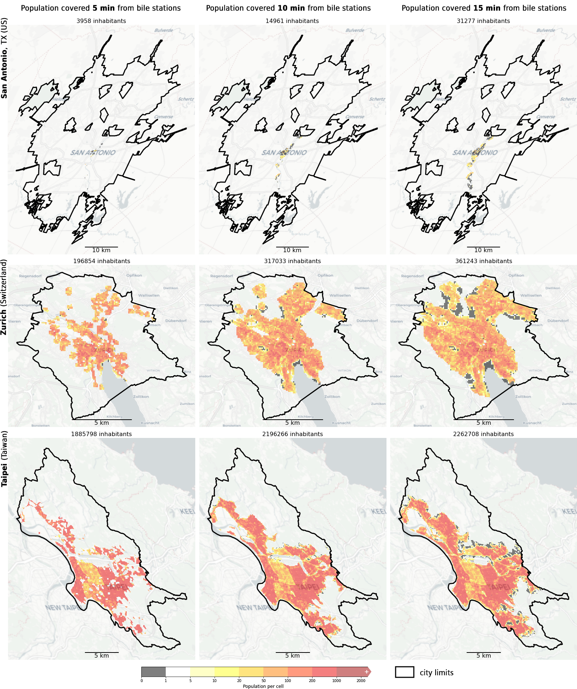

This folder contains the processed data

* **/bike_station_data**
* **bikes_new.geojson**
* **df_cities_data.pkl**: generated by  [code/pop_GHSL_in_bikes_v0.4.ipynb](https://github.com/sachit27/Bike_Accessibility/blob/main/code/pop_GHSL_in_bikes_v0.4.ipynb), stores the basic population data, the bike station counts, and the cropped raster for 100 m resolution grid of population from the GHSL dataset for each analyzed city.
* **gdf_bikes_coverage_crs_esri_54009.pkl**: generated by  [code/pop_GHSL_in_bikes_v0.4.ipynb](https://github.com/sachit27/Bike_Accessibility/blob/main/code/pop_GHSL_in_bikes_v0.4.ipynb), stores the estimation for the population served by the bike sharing services at 5, 10 and 15 min isochrones from the stations, and also the cropped GHSL's 100 m resolution grid population rasters for each of the resuling isochrone areas.

Example of gdf_bikes_coverage_crs_esri_54009.pkl data for 3 cities:
